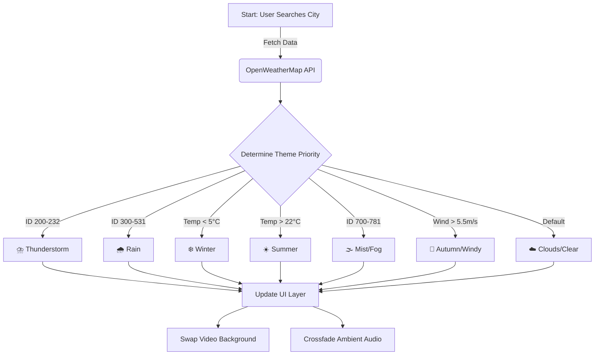

<div align="center">

  <h1>🌤️ Atmospheric Weather App</h1>
  
  <p>
    <b>Experience the weather, don't just read it.</b><br>
    A fully immersive, glassmorphism-based weather dashboard that adapts its visual and audio ambience to real-time conditions.
  </p>

  <p>
    <a href="https://omi-practiced-html-css-js-here.netlify.app/">🔴 Live Demo</a> • 
    <a href="#-setup--installation">🛠️ Installation</a> • 
    <a href="#-features">✨ Features</a>
  </p>

  
  
  
  

</div>

---

## 📖 About The Project

This isn't your average weather app. It is designed to be an **Atmospheric Experience**. 

Instead of simple icons, the application uses **Cinematic Video Backgrounds** and **Spatial Audio** to transport the user to the location. If it's raining in London, you will *see* the rain on your screen and *hear* the droplets falling.

### ✨ Key Features

* **🎨 Glassmorphism UI:** Modern, frosted-glass aesthetic using `backdrop-filter`.
* **🎥 Dynamic Video Backgrounds:** High-quality loops that change based on weather conditions (Rain, Snow, Clear, Thunder, Mist).
* **🔊 Immersive Audio:** Ambient soundscapes (Birds chirping, Wind howling, Rain pattering) that sync with the visuals.
* **⚡ Smart Caching:** "Singleton" audio player pattern to prevent memory leaks and audio crashes.
* **🧠 Intelligent Logic:** Custom algorithms to prioritize hazardous weather (Storms) over standard conditions (Clouds).
* **🌪️ CSS-Only Loader:** A custom-built "Sunrise" animation without external GIFs.

---

## 🧠 Logic & Architecture

The app uses a strict **Priority Queue** system to determine the "Vibe" of the city. We don't just take the API's word for it; we analyze temperature, wind speed, and condition codes to create the perfect atmosphere.



---

## 🛠️ Setup & Installation
Since this project uses a secured ```bash config.js ``` file for API keys, you need to generate it locally.

1. Clone the Repository

      ```Bash
      
      git clone [https://github.com/YourUsername/Weather-App.git](https://github.com/YourUsername/Weather-App.git)
      cd Weather-App
      
      ```
2. Create Config File Create a file named src/js/config.js and add your OpenWeatherMap key:

      ```JavaScript
      
      export const CONFIG = {
          API_KEY: "YOUR_OPENWEATHER_API_KEY", // Replace this
          API_BASE_URL: "[https://api.openweathermap.org/data/2.5/weather](https://api.openweathermap.org/data/2.5/weather)",
          ASSETS: {
              VIDEO_PATH: './assets/videos/',
              SOUND_PATH: './assets/sounds/',
              IMAGE_PATH: './assets/images/'
          }
      };
      
      ```
3. Run Locally Since this uses ES6 Modules, you must use a local server (VS Code Live Server recommended).
      
      - Open index.html with Live Server.

---

##  🚀 Deployment (Netlify/Vercel)
If you are deploying to Netlify, you cannot push your API key to GitHub. Use the included Script Generator:

1. Push your code (excluding config.js).

2. In Netlify, go to Site Settings > Environment Variables.

3. Add MY_WEATHER_KEY with your actual API Key.

4. Set the Build Command to:

    ```Bash
    
    node generate-config.js
    
    ```
5. Deploy! The script will generate the config file on the server automatically.

---

📂 Project Structure
```Bash

Weather-App/
├── assets/
│   ├── videos/       # Optimized .mp4 loops (<5MB)
│   ├── sounds/       # Ambient .mp3 files
│   └── images/       # Fallback posters
├── src/
│   ├── css/
│   │   └── main.css  # Glassmorphism & Animations
│   └── js/
│       ├── api.js    # Fetch logic
│       ├── audio.js  # Howler.js logic
│       ├── ui.js     # DOM Manipulation
│       ├── utils.js  # Theme Priority Logic
│       └── main.js   # Entry point
├── index.html
├── generate-config.js # Deployment script
└── README.md
```

<div align="center">

Made with ❤️ by OMI

OpenWeatherMap API • HTML5 Video • Howler.js • GSAP

</div>
